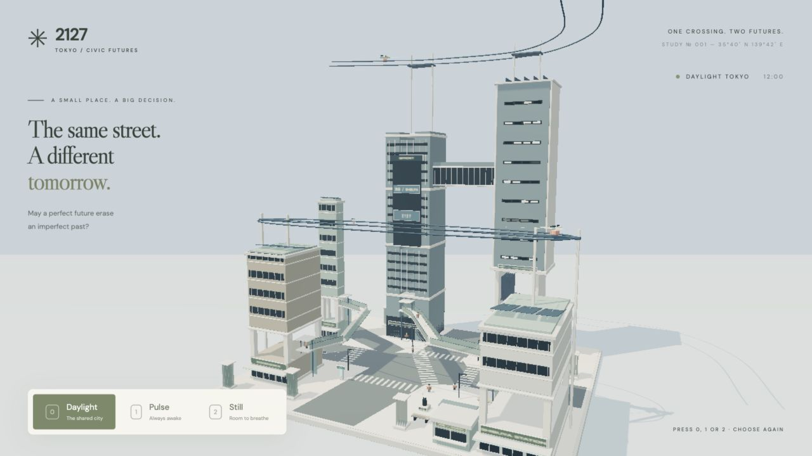

# Plan 02 — 實作進度與下一輪工作

更新：2026-09-17。依據使用者提供的 **Plan 02 Visual + Spatial Implementation Brief**、[Pic 2](../asset/pic2.png)、目前工作樹、測試程式及已保存的畫面核對。這是進度與待辦文件，技術契約見 [PROJECT.md](PROJECT.md)，實際驗證記錄見 [VALIDATION.md](VALIDATION.md)。

**目前完成首個多層空間原型，尚未完成 Plan 02 的視覺驗收。** 狀態以目前未提交的工作樹為準，不代表 main 已包含這些變更；不以完成百分比代替驗收。

核心目標是「2127 年澀谷的紀實照片」：科技應融入建築、交通、公共空間與環境系統。Pic 2 用於量體、垂直性、層次與材質方向，不照搬 UFO、植物、招牌或建築形狀。舊有溫暖彩漆模型風格已被新 brief 取代。

## 判讀方式與證據

- **已完成**：指定的實作或檢查已有對應證據；不代表所有相關美術目標均通過。
- **部分完成**：已有原型，但空間表達、可信度或驗證仍有缺口。
- **待做／待驗證**：尚未有足夠實作或證據；不把設計意圖、註解或測試存在當成完成。

現有畫面：[Daylight](../artifacts/plan02-neutral.jpg) · [Pulse](../artifacts/plan02-pulse.jpg) · [Still](../artifacts/plan02-still.jpg)，均為 1280×720。與 Pic 2 的比較是美術判斷，不是量化相似度測試。

## 原定 A–G 階段進度

| 階段 | 狀態 | 已有內容 | 尚欠內容 |
| --- | --- | --- | --- |
| A 建築量體與材質 | 部分完成 | 增高地標、公共層開口、QFRONT–MAGNET 上層連接、淺色 PBR 表面 | 仍以細長直塔為主；未形成巨型垂直街區，玻璃與立面深度不足 |
| B 第一層 3D crossing | 部分完成 | 兩條有端點的公共步道、斜坡、轉角板、端點升降與行人 | 建築入口／平台交接仍簡化；需檢查真實網格穿插及雙向通行表達 |
| C 有組織的天空基建 | 部分完成 | 雙軌走廊、屋頂支架、周邊支柱、既有貨運站 | 仍偏向附加線條；與建築整合、進出節點及支承可信度需加強 |
| D 工程化生態 | 部分完成 | 移除傳統樹冠與盆栽，加入膜片／鰭片形式 | 淨化、冷卻或水管理的用途尚不能從畫面清楚理解；沒有環境模擬 |
| E 密度與預設動線 | 部分完成 | 降低人車與循環飛行器密度；分開地面／高架人流 | 尚未完成可比時刻的人數評估；高架行人共用中心線，個體差異與交會仍簡化 |
| F 光照與材質呈現 | 部分完成 | 三態日光、輕霧、低 bloom、一次性環境反射 | 仍有模型底板、均質表面與微縮感；未達紀實照片質感 |
| G 固定鏡頭截圖與評估 | 已完成本輪 | 三態截圖已保存／開啟檢查，缺口已記錄 | 下一輪修改後必須重新驗證；本輪截圖不構成最終美術通過 |

## 已完成的實作

- [x] 保留一個路口、QFRONT／MAGNET／八公廣場等地標關係、五條地面 crossing 端點。[layout.ts](../src/layout.ts)
- [x] 地標高度調整為 QFRONT 48、MAGNET 58、Center-gai 32、Dogenzaka 24、車站 18；單位為場景 art units，非現實測繪公尺。
- [x] QFRONT 與 MAGNET 之間建立一個中心高度 Y=39 的上層建築連接；它是建築量體，沒有室內人流模擬。[cityRig.ts](../src/cityRig.ts)
- [x] QFRONT → 車站公共路徑位於 Y=8–10；Dogenzaka → Center-gai 位於 Y=6–9。步道幾何與行人採用同一組路徑資料。
- [x] 公共路徑採用 48 秒單程：15% 升降、70% 步行、15% 升降，下一程反向；小平台陪同行人垂直移動。[publicJourney](../src/layout.ts)
- [x] 保留地面 30 秒交通週期、MAGNET 的 Y=15 貨運站與 32 秒物流交收。[mobility.ts](../src/mobility.ts)
- [x] 保留 24 個行人 slot，分成 12 地面／12 公共路徑；降低可見密度。Slot 容量不是同時可見人數。
- [x] 循環航線提高至約 Y=32，express 約 Y=66–67；沿共用航線加入軌道與支架，減少循環飛行器。保留薄翼貨機。
- [x] 移除行人手旁原有發光裝置及舊 2026 道具；沒有加入手機／穿戴螢幕行為。
- [x] 保留商店、車站入口、交番與八公標記；加入公共層與住宅樓層的幾何暗示。這不等於商住功能已充分可讀。
- [x] 所有狀態使用日光；中性狀態顯示 Daylight。數值 presets 與 10 秒轉場／4 秒鎖定機制保留，`timeOfDay` 不再控制太陽。[main.ts](../src/main.ts)、[worldState.ts](../src/worldState.ts)
- [x] 保留固定展示鏡頭與一般 resize；控制列移至左下以露出路口。[heroCamera.ts](../src/heroCamera.ts)、[overlay.ts](../src/overlay.ts)、[style.css](../src/style.css)
- [x] 保留固定種子 2127、靜態材質批次、InstancedMesh、WebGL 2、共享資源與一次性建築建立；沒有新增框架、模型資產或後端。

## 視覺驗收：哪些還未過

| Brief 要求 | 目前判定 | 下一步要看到的證據 |
| --- | --- | --- |
| 一眼看出澀谷 | 部分完成 | 巨型交叉口、斜向人流、QFRONT／八公／車站關係可讀，不主要依賴招牌文字 |
| 明顯不是當代澀谷 | 部分完成 | 城市組織本身不同，而不只是高樓加高架配件 |
| 強烈垂直城市與巨型建築 | 部分完成 | 相連公共層、住宅量體及大型開口形成整體；消除獨立直塔排列感 |
| 交叉口是 3D 都市系統 | 部分完成 | 地面、斜向步道與垂直轉乘能在同一固定鏡頭中讀懂 |
| 高效率、低混亂而有人的差異 | 部分完成 | 步道與升降交會可信，沒有明顯重疊、排隊穿插或整齊列隊感 |
| 可見行人明顯減少 | 已降低密度映射；比較待補 | 同一狀態及相近交通階段比較 Plan 01／02，記錄可見人數而非 pool 大小 |
| 天空是交通基建、不是飛車展示 | 部分完成 | 走廊、支承、貨站、進出節點構成可理解的系統，並留有負空間 |
| 科技融入城市與人類用途 | 部分完成 | 建築、公共服務、商業與環境系統的功能比裝飾燈更清楚 |
| 自然以工程化形式出現 | 部分完成 | 膜片能表達一項環境功能，避免只是另一種盆栽替代物 |
| 無手機中心行為 | 本輪已符合 | 後續人物／商業細節繼續使用環境式介面 |
| 清潔、維護良好 | 本輪已符合 | 精準接縫、材料區分與可信細節；不以污垢或鏽蝕製造寫實感 |
| 有商店、有住宅 | 僅幾何暗示 | 商店入口與消費場所可辨，住宅有可讀樓層與生活尺度 |
| 數據化生活、微妙環境資訊 | 待做 | 至少一項融入食物、環境或公共服務的簡約提示；現有 AIR／PICKUP 文字不足以代表此項 |
| 紀實照片、沒有玩具／模型感 | 未通過 | 改善量體、構圖、玻璃／立面深度及地面邊界後再比較畫面 |
| 不靠 cyberpunk、UFO、霓虹或植物堆砌 | 本輪避開主要禁項 | 後續仍以白天建築與空間組織為主；避開禁項不等於 2127 身份已成立 |

## 下一輪：先解決量體與構圖

按照 P0 世界身份 → P1 視覺語言 → P2 小細節的順序。以下為待做工作，未宣稱已實作。

### 1. P0：讓建築形成垂直街區

- [ ] 優先重做 QFRONT／MAGNET 的相連量體，以大型開口、公共層、錯層及懸挑打破直塔輪廓。沿用既有 factory，不新增通用建築生成框架。
- [ ] 將高架步道入口、貨運站及上層連接納入建築結構；檢查支柱／支架確實接到可承托的量體。
- [ ] 同步更新改動量體的保守碰撞範圍，檢查貨機翼展與物流通道；不可縮小測試範圍來掩蓋穿插。

**通過條件：** 不靠新增招牌，截圖已能讀出相連的巨型街區；地面路口仍開放，MAGNET 貨運站保留真實開口。若仍像幾棟獨立高樓，先修量體，不加配件。

### 2. P0：把路口與人尺度放回構圖中心

- [ ] 隨量體調整單一固定桌面鏡位，兼顧地面斜向 crossing、高架步道及建築入口，不加入 orbit controls 或自適應鏡頭。
- [ ] 維持 QFRONT／八公廣場／車站的空間辨識，檢查介面與前景量體是否遮擋主要交叉動線。
- [ ] 整理底板與地面邊界的視覺收尾，減少「模型放在展示台上」的觀感；不擴建第二個路口。

**通過條件：** 同一張桌面截圖可辨認地面、公共步道、垂直入口與空中系統；人物仍可辨，建築是主體，路口沒有被高樓或 UI 遮住。

### 3. P1：改善材質、立面深度與光照

- [ ] 加強門窗凹位、樓板厚度、接縫與遮陽結構的深度，區分複合材、精製金屬及玻璃。
- [ ] 改善玻璃與反射的可讀性，避免整片深色板或所有材質同樣發亮；先用現有 Three.js 能力與共享資源。
- [ ] 調整明暗／大氣層次，保持明亮而不過曝；不可依賴夜景、強 bloom、髒污或重型後製掩蓋量體問題。

**通過條件：** 材料能區分，樓層及陰影有深度；以新截圖重新判斷是否仍有模型感，不能只因材質參數改過就標記完成。

### 之後才處理的細節

- [ ] 精修公共升降平台與樓板交接，檢查轉角、平台穿板、雙向交會及可見重疊；優先調整 authored 幾何與時序。
- [ ] 用已有商住／公共層強化人類用途，不將所有建築改成無法辨識的抽象雕塑。
- [ ] 將膜片整合到建築，表達一項冷卻／淨化／水管理用途；保持視覺原型，不建立生態模擬。
- [ ] 補一項低調的數據化生活提示；放在相關服務或環境位置，不做 dashboard 牆。
- [ ] 必要時微調行人錯峰、步行差異與密度，保留少量生活感；不增加人群規模。

## 驗證進度與下一輪交付

上一次實作的記錄（2026-09-17，Node 26）：

- `npm test` 與 `npm run build` 通過；build 仍有既有 >500 kB bundle 警告。
- [mobility.test.ts](../tests/mobility.test.ts) 涵蓋地面時段、五條 crossing、等待位置、航線地標淨空、物流連續性，並增加公共行程連續性、端點、物流分隔及上層建築連接的航線淨空檢查。
- [worldState.test.ts](../tests/worldState.test.ts) 涵蓋轉場、判決、鎖定、重新選擇與 neutral reset。
- 瀏覽器已驗證三態、按鈕／快捷鍵、轉場輸入鎖定、判決及返回 Daylight；動態抽查超過 60 秒。三張固定鏡位畫面已保存。
- 當時 error／warning log 為空；Pulse／Still 暖機觀測為 56 個 GPU geometry、115 次 composer draw call。**不是 1080p 效能保證。**

仍未有的驗證：完整公共平台／樓板／軌道／支柱網格碰撞、行人互相避讓、升降容量、每一幀物流錄影、1080p 效能基準及最終美術認可。現有連續性測試不能替代這些檢查；其中避讓／容量模擬不是本原型必須新增的系統。

下一輪交付清單：

- [ ] 執行 `npm test`、`npm run build`，在量體變更後重新檢查航線與物流淨空。
- [ ] 依 [VALIDATION.md](VALIDATION.md) 檢查三態、至少兩個地面交通週期及完整物流流程；補查高架行人與平台交接。
- [ ] 用相同 1280×720 viewport 保存三態新圖，保留本輪 `plan02-*.jpg` 作基線。若鏡位有改，明確註記，不能稱為相同鏡位比較。
- [ ] 對照 Pic 2 與本文件的視覺驗收表，逐項更新證據／缺口；P0 未成立前不擴充更多裝飾或交通種類。
- [ ] 更新本文件、技術契約及驗收記錄；沒有量測就不宣稱 FPS，沒有視覺驗證就不宣稱美術通過。

本次文件整理只核對程式、既有測試內容、記錄與保存畫面，沒有修改執行程式，也沒有重跑 build 或瀏覽器驗證。以上通過記錄屬上一輪實作。

## 範圍限制

保持單一路口、固定種子、三態、固定桌面鏡頭、WebGL 2、instancing 及 shared materials。暫不新增飛行器種類、更多招牌、物理、通用尋路、後端、部署、外部資產包、新框架或 mobile／responsive 工作。這些不是必須補完的待辦；目前最重要的缺口是建築與空間表達。
