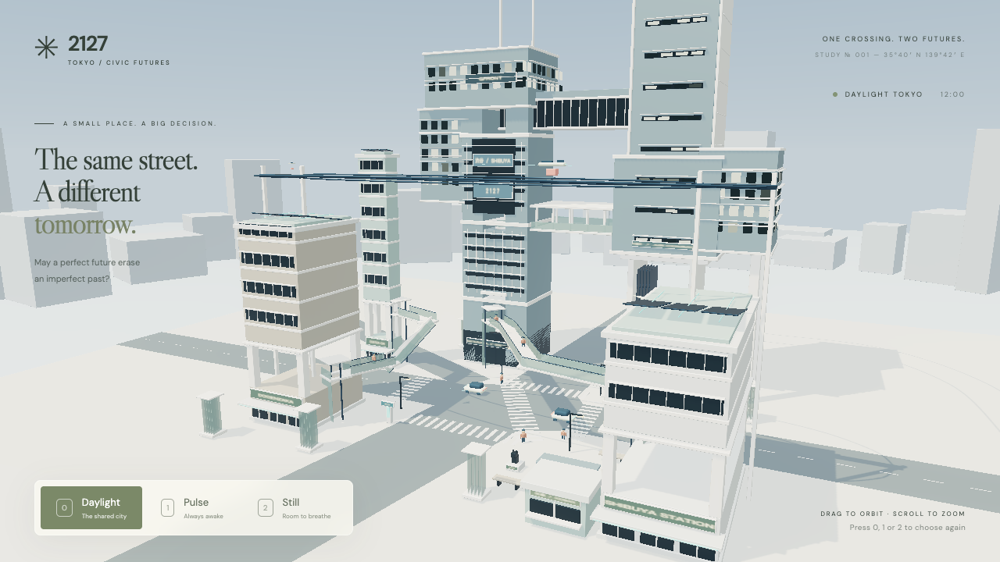

# 展覽方向與 Plan 02 歷史紀錄

## 現行方向 — 2026-09-18

**展覽由每一位 guest 的選擇，逐步塑造一個富有未來感的澀谷。** 視覺呈現要讓觀眾感受到未來城市，並看懂自己對共同成果的影響；「超靚模型」或「紀實照片質感」不再是首要目標或完成門檻。

已確認流程：每位 guest 回答一條題目、選擇一個 option；城市承接之前 guest 的結果作出相應變化；該位 guest 體驗完結時即時看見畫面變化；下一位 guest 接續下一條題目。城市跨 guest 累積，換人不自動重設。全部題目完成後及每日展覽的重設規則待定。

建築數量／密度、人流等是可能改變的參數。具體如何變、變多少、如何組合不同選擇，留待後續設計；不預先承諾新增某類模擬系統。現有三態、建築只建立一次、10 秒轉場與 4 秒鎖定屬於原型現況，不是展覽互動的永久限制。

### 新優先次序與待定事項

1. 先定義體驗：題目／選項、每位 guest 的體驗結束時點，以及如何交接下一題。每人一題與跨人累積已確認。
2. 再定義選擇的可見後果：參數映射、累積規則與上下限，確保觀眾能辨認自己的選擇帶來的改變。
3. 釐清展覽運作：題目用完後的安排、重設、重新載入後是否保留、輸入裝置與保存方式。跨 guest 累積不等於已選定後端或永久儲存方案。
4. 按已定互動需要安排實作與美術，讓未來感、澀谷辨識度和變化可讀性支援展覽體驗。Pic 2 與既有多層城市可沿用作參考，不以完成舊美術清單作互動設計的前置條件。

以上是後續設計順序，並非已批准的實作階段。新流程、累積系統及可變建築均未實作。今次只同步文檔；目前程式、測試、畫面及素材維持原樣。單一澀谷場景與桌面展示範圍保留，詳細契約見 [PROJECT.md](PROJECT.md)，未來驗收方向見 [VALIDATION.md](VALIDATION.md)。

## 歷史：Plan 02 實作進度與當時待辦（2026-09-17）

**以下保留當時的進度、判斷、優先次序及驗證紀錄。** 其中「核心目標」、「下一輪」、「通過條件不變」及「範圍限制」均指舊 Plan 02，不再支配現行展覽方向；未勾選的美術項目不會自動成為下一階段工作。新方向以上方 2026-09-18 決策為準。

更新：2026-09-17（stage 5 升降平台／樓板交接完成後）。依據使用者提供的 **Plan 02 Visual + Spatial Implementation Brief**、[Pic 2](../asset/pic2.png)、目前工作樹、測試程式及已保存的畫面核對。這是進度與待辦文件，技術契約見 [PROJECT.md](PROJECT.md)，實際驗證記錄見 [VALIDATION.md](VALIDATION.md)。

**目前完成首個多層空間原型與 stage 1 垂直街區量體，尚未完成 Plan 02 的視覺驗收。** 狀態以目前未提交的工作樹為準，不代表 main 已包含這些變更；不以完成百分比代替驗收。

核心目標是「2127 年澀谷的紀實照片」：科技應融入建築、交通、公共空間與環境系統。Pic 2 用於量體、垂直性、層次與材質方向，不照搬 UFO、植物、招牌或建築形狀。舊有溫暖彩漆模型風格已被新 brief 取代。

## 判讀方式與證據

- **已完成**：指定的實作或檢查已有對應證據；不代表所有相關美術目標均通過。
- **部分完成**：已有原型，但空間表達、可信度或驗證仍有缺口。
- **待做／待驗證**：尚未有足夠實作或證據；不把設計意圖、註解或測試存在當成完成。

Stage 5 畫面（升降平台與樓板交接，鏡位同 stage 2）：[Daylight](../artifacts/plan02-lift-neutral.png) · [Pulse](../artifacts/plan02-lift-pulse.png) · [Still](../artifacts/plan02-lift-still.png)。Stage 4 畫面（天空與遠景，鏡位同 stage 2）：[Daylight](../artifacts/plan02-sky-neutral.png) · [Pulse](../artifacts/plan02-sky-pulse.png) · [Still](../artifacts/plan02-sky-still.png)。Stage 3 畫面（材質／光照，鏡位同 stage 2）：[Daylight](../artifacts/plan02-surface-neutral.png) · [Pulse](../artifacts/plan02-surface-pulse.png) · [Still](../artifacts/plan02-surface-still.png)。Stage 2 畫面（新鏡位）：[Daylight](../artifacts/plan02-frame-neutral.png) · [Pulse](../artifacts/plan02-frame-pulse.png) · [Still](../artifacts/plan02-frame-still.png)。Stage 1 畫面（舊鏡位）：[Daylight](../artifacts/plan02-block-neutral.png) · [Pulse](../artifacts/plan02-block-pulse.png) · [Still](../artifacts/plan02-block-still.png)；stage 1 前基線：[Daylight](../artifacts/plan02-neutral.jpg) · [Pulse](../artifacts/plan02-pulse.jpg) · [Still](../artifacts/plan02-still.jpg)。均為 1280×720；stage 2 起鏡位已改，與之前的圖不是同鏡位比較。與 Pic 2 的比較是美術判斷，不是量化相似度測試。

## 原定 A–G 階段進度

| 階段 | 狀態 | 已有內容 | 尚欠內容 |
| --- | --- | --- | --- |
| A 建築量體與材質 | 部分完成 | 增高地標、公共層開口、Y=39 連接與 Y=24 開放公共層、QFRONT 冠部＋懸吊西翼、MAGNET 中段環帶＋東翼、淺色 PBR 表面 | 兩座核心仍偏高瘦，只靠橫向量體相連；玻璃與立面深度不足 |
| B 第一層 3D crossing | 部分完成（stage 5 已改善） | 兩條有端點的公共步道、斜坡、轉角板、端點升降與行人；端點為開口框架，步道在端點前 1.5 單位止步，平台穿框而非穿板；雙向各行一側；轉角欄杆斜接閉合 | 建築入口交接仍簡化 |
| C 有組織的天空基建 | 部分完成 | 雙軌走廊、屋頂支架、周邊支柱、既有貨運站 | 仍偏向附加線條；與建築整合、進出節點及支承可信度需加強 |
| D 工程化生態 | 部分完成 | 移除傳統樹冠與盆栽，加入膜片／鰭片形式 | 淨化、冷卻或水管理的用途尚不能從畫面清楚理解；沒有環境模擬 |
| E 密度與預設動線 | 部分完成（stage 5 已改善） | 降低人車與循環飛行器密度；分開地面／高架人流；同路線行人間隔 16 秒，升降機不共乘，對向行人分側交會 | 尚未完成可比時刻的人數評估；個體步行差異仍簡化 |
| F 光照與材質呈現 | 部分完成（stage 3 已改善） | 三種表面：霧面複合材、精製金屬、反射玻璃；每層遮陽鰭片投影；環境反射 .6、曝光 .9、日光 3.0 | Stage 4 加入漸層天空與霧化遠景；仍有微縮感；未達紀實照片質感 |
| G 固定鏡頭截圖與評估 | 已完成本輪 | Stage 2 新鏡位三態截圖已保存／開啟檢查，缺口已記錄 | 下一輪修改後必須重新驗證；本輪截圖不構成最終美術通過 |

## 已完成的實作

- [x] 保留一個路口、QFRONT／MAGNET／八公廣場等地標關係、五條地面 crossing 端點。[layout.ts](../src/layout.ts)
- [x] 地標高度調整為 QFRONT 48、MAGNET 58、Center-gai 32、Dogenzaka 24、車站 18；單位為場景 art units，非現實測繪公尺。
- [x] QFRONT 與 MAGNET 之間建立一個中心高度 Y=39 的上層建築連接；它是建築量體，沒有室內人流模擬。[cityRig.ts](../src/cityRig.ts)
- [x] QFRONT → 車站公共路徑位於 Y=8–10；Dogenzaka → Center-gai 位於 Y=6–9。步道幾何與行人採用同一組路徑資料。
- [x] 公共路徑採用 48 秒單程：15% 升降、70% 步行、15% 升降，下一程反向；小平台陪同行人垂直移動。[publicJourney](../src/layout.ts)
- [x] 保留地面 30 秒交通週期、MAGNET 的 Y=15 貨運站與 32 秒物流交收。[mobility.ts](../src/mobility.ts)
- [x] 保留 24 個行人 slot，分成 12 地面／12 公共路徑；降低可見密度。Slot 容量不是同時可見人數。
- [x] 循環航線提高至約 Y=32，express 約 Y=66–67；沿共用航線加入軌道與支架，減少循環飛行器。保留薄翼貨機。
- [x] 移除行人手旁原有發光裝置及舊 2026 道具；沒有加入手機／穿戴螢幕行為。
- [x] 保留商店、車站入口、交番與八公標記；加入公共層與住宅樓層的幾何暗示。這不等於商住功能已充分可讀。
- [x] 所有狀態使用日光；中性狀態顯示 Daylight。數值 presets 與 10 秒轉場／4 秒鎖定機制保留，`timeOfDay` 不再控制太陽。[main.ts](../src/main.ts)、[worldState.ts](../src/worldState.ts)
- [x] 保留固定展示鏡頭與一般 resize；控制列移至左下以露出路口。[heroCamera.ts](../src/heroCamera.ts)、[overlay.ts](../src/overlay.ts)、[style.css](../src/style.css)
- [x] 保留固定種子 2127、靜態材質批次、InstancedMesh、WebGL 2、共享資源與一次性建築建立；沒有新增框架、模型資產或後端。
- [x] Stage 1（2026-09-17）：`upperLinks` 擴為五個上層量體（Y=39 連接、Y=24 開放公共層、QFRONT 冠部、QFRONT 西翼、MAGNET 東翼），各自標明承托核心與落地柱；QFRONT 冠部與西翼形成一個掛在雙核心上的托架，MAGNET 加中段環帶。測試新增承托、柱位避開道路、貨運柱與公共步行者淨空。[layout.ts](../src/layout.ts)、[cityRig.ts](../src/cityRig.ts)、[mobility.test.ts](../tests/mobility.test.ts)
- [x] 使用者於 commit 5ad7dd0 加入 OrbitControls；初始鏡位不變，截圖一律以未觸碰的初始鏡位比較。

## 視覺驗收：哪些還未過

| Brief 要求 | 目前判定 | 下一步要看到的證據 |
| --- | --- | --- |
| 一眼看出澀谷 | 部分完成 | 巨型交叉口、斜向人流、QFRONT／八公／車站關係可讀，不主要依賴招牌文字 |
| 明顯不是當代澀谷 | 部分完成 | 城市組織本身不同，而不只是高樓加高架配件 |
| 強烈垂直城市與巨型建築 | 部分完成（stage 1 已改善） | 冠部／翼樓／環帶已打破直塔輪廓，兩座核心以兩層公共層相連；仍需判斷是否已讀為一個街區而非「兩塔加橫樑」 |
| 交叉口是 3D 都市系統 | 部分完成 | 地面、斜向步道與垂直轉乘能在同一固定鏡頭中讀懂 |
| 高效率、低混亂而有人的差異 | 部分完成（stage 5 已改善） | 測試已保證同路線行人不共乘升降機、對向間距 ≥ .9；仍待使用者判斷是否仍有列隊感 |
| 可見行人明顯減少 | 已降低密度映射；比較待補 | 同一狀態及相近交通階段比較 Plan 01／02，記錄可見人數而非 pool 大小 |
| 天空是交通基建、不是飛車展示 | 部分完成 | 走廊、支承、貨站、進出節點構成可理解的系統，並留有負空間 |
| 科技融入城市與人類用途 | 部分完成 | 建築、公共服務、商業與環境系統的功能比裝飾燈更清楚 |
| 自然以工程化形式出現 | 部分完成 | 膜片能表達一項環境功能，避免只是另一種盆栽替代物 |
| 無手機中心行為 | 本輪已符合 | 後續人物／商業細節繼續使用環境式介面 |
| 清潔、維護良好 | 本輪已符合 | 精準接縫、材料區分與可信細節；不以污垢或鏽蝕製造寫實感 |
| 有商店、有住宅 | 僅幾何暗示 | 商店入口與消費場所可辨，住宅有可讀樓層與生活尺度 |
| 數據化生活、微妙環境資訊 | 待做 | 至少一項融入食物、環境或公共服務的簡約提示；現有 AIR／PICKUP 文字不足以代表此項 |
| 紀實照片、沒有玩具／模型感 | 未通過 | 改善量體、構圖、玻璃／立面深度及地面邊界後再比較畫面 |
| 不靠 cyberpunk、UFO、霓虹或植物堆砌 | 本輪避開主要禁項 | 後續仍以白天建築與空間組織為主；避開禁項不等於 2127 身份已成立 |

## 下一輪：先解決量體與構圖

按照 P0 世界身份 → P1 視覺語言 → P2 小細節的順序。以下為待做工作，未宣稱已實作。

### 1. P0：讓建築形成垂直街區（stage 1 已實作，待使用者美術判斷）

- [x] 重做 QFRONT／MAGNET 的相連量體：冠部、懸吊西翼、中段環帶、東翼與 Y=24 開放公共層。沿用既有 box／windows 工具，沒有新增建築生成框架。
- [x] 步道入口加門楣；上層量體以 `on` 標明承托核心，東翼有兩根落地柱，測試確認柱位落在量體內且避開道路。
- [x] 碰撞範圍：所有新量體進入 `upperLinks`，由既有航線淨空測試加上新的貨運柱／步行者淨空檢查覆蓋；沒有縮小任何測試範圍。
- [ ] 使用者對照 stage 1 截圖判斷是否已讀為相連街區；若仍像兩塔加橫樑，下一步是加厚核心或把西翼／東翼延伸成連續住宅帶，而不是加配件。

**通過條件不變：** 不靠新增招牌，截圖已能讀出相連的巨型街區；地面路口仍開放，MAGNET 貨運站保留真實開口（stage 1 兩者均保持）。

### 2. P0：把路口與人尺度放回構圖中心（stage 2 已實作，待使用者美術判斷）

- [x] 初始鏡位改為 `(34,34,76)` 看向 `(-3,17,-1)`、FOV 46°，OrbitControls 的 target 共用同一定義；沒有自適應鏡頭。路口、兩條高架步道、QFRONT 門楣與 Y=24 公共層在同一畫面可見，MAGNET 頂部與 express 走廊刻意出框。
- [x] QFRONT／八公廣場／車站關係保持；控制列在左下，路口在畫面中下不被 UI 遮住。左側標題文字與 Dogenzaka 塊略有重疊，可接受。
- [x] 底板放大到 150×140、五條道路臂延伸到 ±70–75，鏡位內看不到底板邊；沒有第二個路口，車輛行駛範圍不變。
- [ ] 使用者判斷新鏡位是否成立；若要保留舊構圖比較，stage 1 的 `plan02-block-*.png` 仍在。

**通過條件不變：** 同一張桌面截圖可辨認地面、公共步道、垂直入口與空中系統；人物仍可辨，建築是主體，路口沒有被高樓或 UI 遮住。

### 3. P1：改善材質、立面深度與光照（stage 3 已實作，待使用者美術判斷）

- [x] 每個窗層在每個立面加一片遮陽鰭片（`windows()`、MAGNET 環帶、QFRONT 樓層、商住樓層），商住樓板加厚到 .34；深度來自投影而不是每扇窗的凹位幾何。
- [x] 材質分成三種：霧面複合材（粗糙度 .45–.58）、精製金屬 `solar`（金屬度 .85）、反射玻璃 `dark`（粗糙度 .16、金屬度 .7）；路面另用霧面 `ground`。沒有新增貼圖、後製或第二個環境圖。
- [x] 環境反射 .3→.6、日光 2.6→3.0、半球光 1.3→1.05、曝光 .95→.9；三態仍為白天，bloom 不變。
- [ ] 使用者判斷是否仍有模型感。實作者的判讀：樓層深度與玻璃已可讀，但單色天空與沒有遠景仍讓場景像展示模型；這不屬本階段範圍，需另行決定是否加天空層次或遠景剪影。

**通過條件不變：** 材料能區分，樓層及陰影有深度；以新截圖重新判斷是否仍有模型感，不能只因材質參數改過就標記完成。

### 4. 追加：天空層次與遠景（2026-09-17 使用者核准，stage 4 已實作）

原計畫沒有這一項；stage 1–3 之後，單色天空與空白地平線成為最強的「模型感」來源，因此追加。

- [x] 漸層天空球（150 單位、跟隨鏡頭、不受霧影響）：地平線色沿用各狀態背景色，天頂色另設三個較深色調。[main.ts](../src/main.ts)
- [x] 固定種子的 60 座遠景霧化量體，半徑 125–165，落在底板外；單一材質依狀態微調色調。[cityRig.ts](../src/cityRig.ts)
- [x] 鏡頭遠裁切 240→320 以容納遠景。
- [ ] 使用者判斷遠景密度／高度是否恰當；若仍嫌搶眼，先降高度與對比，不加細節。

**通過條件：** 路口被城市包圍而不是放在展示台上；遠景只是霧中剪影，不與地標競爭。

### 5. 追加：公共升降平台與樓板交接（stage 5 已實作，待使用者美術判斷）

- [x] 同路線行人起步間隔由 6.7 秒改為 16 秒（`index*8`）：升降窗口各 14.4 秒、間隔 1.6 秒，任何時刻同一部升降機只有一人；對向行人在步道中段而非門口交會。[layout.ts](../src/layout.ts)
- [x] 每個方向各行一側（lane ±.5），lane 沿折線以斜接方式偏移，轉角處不跳位；乘梯時滑回井道中心線，往返反向仍連續。平台固定在井道中心並隨步道方向旋轉，乘客站在平台上偏一側。[layout.ts](../src/layout.ts)、[mobility.ts](../src/mobility.ts)
- [x] 端點改為對齊步道方向的框架：3×3 落地框留 1.6 開口讓平台升降穿過，步道在端點前 1.5 單位止步，不再有實心板被平台或行人穿過；軌道、背板膜片與頂蓋保留。[cityRig.ts](../src/cityRig.ts)
- [x] 測試新增：乘梯時乘客與平台中心距離 ≤ .5；同路線任兩人不同時乘梯（距離 > 3）；其餘時刻水平距離 > .9。[mobility.test.ts](../tests/mobility.test.ts)
- [x] 轉角欄杆斜接：每個內側轉角以有號斜接長度延長外側欄杆、縮短內側欄杆，轉角閉合且不交叉（2026-09-17 使用者要求後補）。[cityRig.ts](../src/cityRig.ts)
- [ ] 使用者從近距離鏡位判斷升降框架、分側通行是否可讀。

**通過條件：** 沒有平台或行人穿過實心樓板；對向行人並肩通過而非重疊；升降機一次一人。

### 之後才處理的細節

- [x] 精修公共升降平台與樓板交接（stage 5，含轉角欄杆斜接）。
- [ ] 用已有商住／公共層強化人類用途，不將所有建築改成無法辨識的抽象雕塑。
- [ ] 將膜片整合到建築，表達一項冷卻／淨化／水管理用途；保持視覺原型，不建立生態模擬。
- [ ] 補一項低調的數據化生活提示；放在相關服務或環境位置，不做 dashboard 牆。
- [ ] 必要時微調行人錯峰、步行差異與密度，保留少量生活感；不增加人群規模。

## 驗證進度與下一輪交付

Stage 1 記錄見 [VALIDATION.md](VALIDATION.md) 的「Plan 02 stage 1」。上一次實作的記錄（2026-09-17，Node 26）：

- `npm test` 與 `npm run build` 通過；build 仍有既有 >500 kB bundle 警告。
- [mobility.test.ts](../tests/mobility.test.ts) 涵蓋地面時段、五條 crossing、等待位置、航線地標淨空、物流連續性，並增加公共行程連續性、端點、物流分隔及上層建築連接的航線淨空檢查。
- [worldState.test.ts](../tests/worldState.test.ts) 涵蓋轉場、判決、鎖定、重新選擇與 neutral reset。
- 瀏覽器已驗證三態、按鈕／快捷鍵、轉場輸入鎖定、判決及返回 Daylight；動態抽查超過 60 秒。三張固定鏡位畫面已保存。
- 當時 error／warning log 為空；Pulse／Still 暖機觀測為 56 個 GPU geometry、115 次 composer draw call。**不是 1080p 效能保證。**

仍未有的驗證：完整公共平台／樓板／軌道／支柱網格碰撞、行人互相避讓、升降容量、每一幀物流錄影、1080p 效能基準及最終美術認可。現有連續性測試不能替代這些檢查；其中避讓／容量模擬不是本原型必須新增的系統。

下一輪交付清單：

- [ ] 執行 `npm test`、`npm run build`，在量體變更後重新檢查航線與物流淨空。
- [ ] 依 [VALIDATION.md](VALIDATION.md) 檢查三態、至少兩個地面交通週期及完整物流流程；補查高架行人與平台交接。
- [ ] 用相同 1280×720 viewport 保存三態新圖，保留本輪 `plan02-*.jpg` 作基線。若鏡位有改，明確註記，不能稱為相同鏡位比較。
- [ ] 對照 Pic 2 與本文件的視覺驗收表，逐項更新證據／缺口；P0 未成立前不擴充更多裝飾或交通種類。
- [ ] 更新本文件、技術契約及驗收記錄；沒有量測就不宣稱 FPS，沒有視覺驗證就不宣稱美術通過。

Stage 1–5 均已重跑 `npm test`、`npm run build` 與 1280×720 三態截圖；1080p 效能未量測，美術通過待使用者判斷。

## 範圍限制

保持單一路口、固定種子、三態、固定桌面鏡頭、WebGL 2、instancing 及 shared materials。暫不新增飛行器種類、更多招牌、物理、通用尋路、後端、部署、外部資產包、新框架或 mobile／responsive 工作。這些不是必須補完的待辦；目前最重要的缺口是建築與空間表達。
